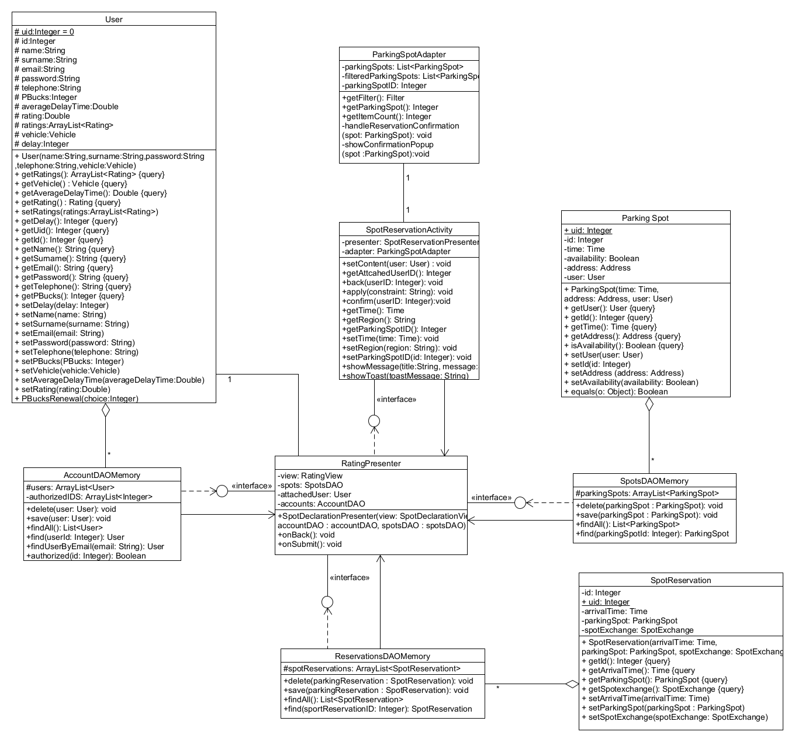

# Διαγράμματα κλάσεων

### **Sign In**

### **Sign Up Personal**

### **Sign Up Vehicle**

### **Homepage**

### **View Profile**

### **Edit Profile**

### **Add PBucks**

### **Spot Declaration**

### **Spot Reservation**

### **Rating**

