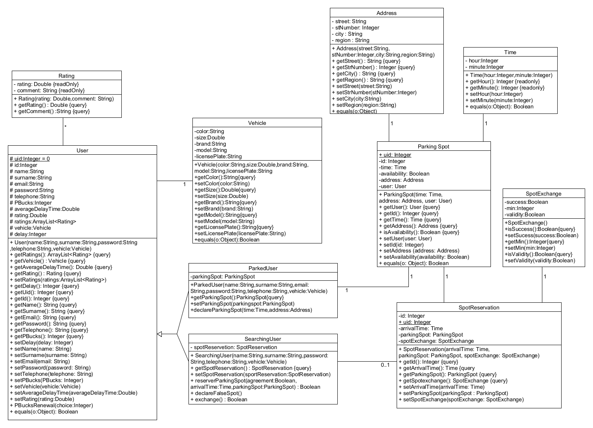
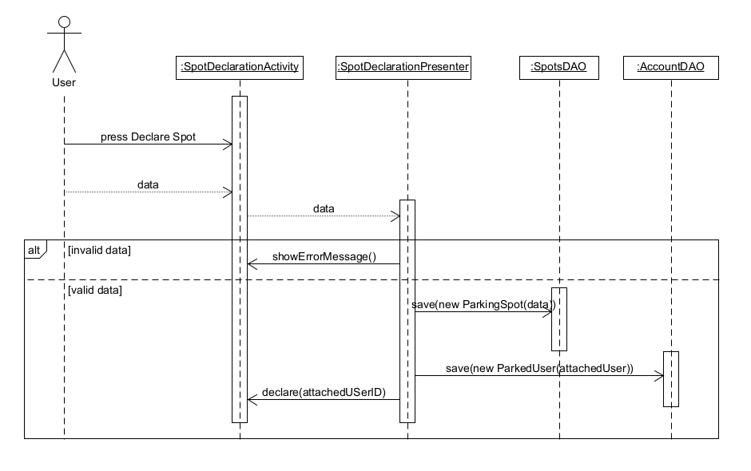
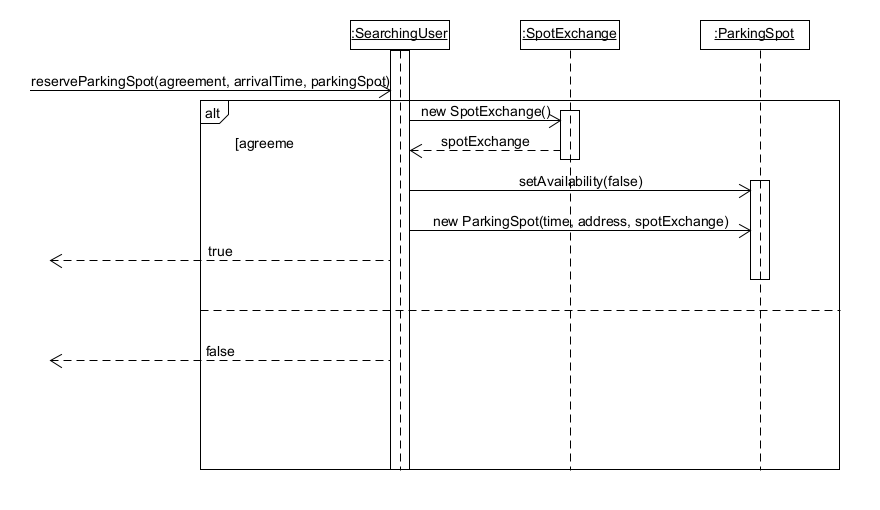

# Σχεδιασμός Λογισμικού

## **Domain Model**

## **Class Diagram**

## **Sequence Diagrams**

### **Sign Up**

### **User Verification**

### **Parking Spot Declaration**

### **Parking Spot Reservation**

### **Parking Spot Exchange**

### **False Address Declaration**

