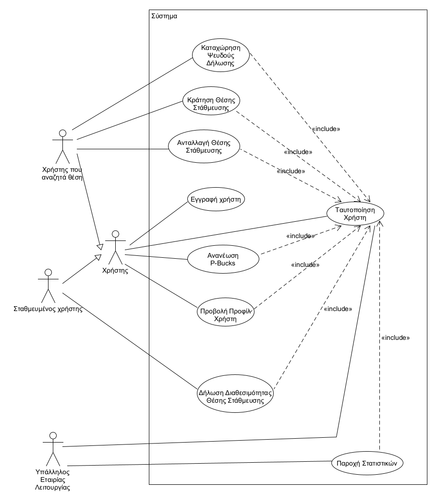
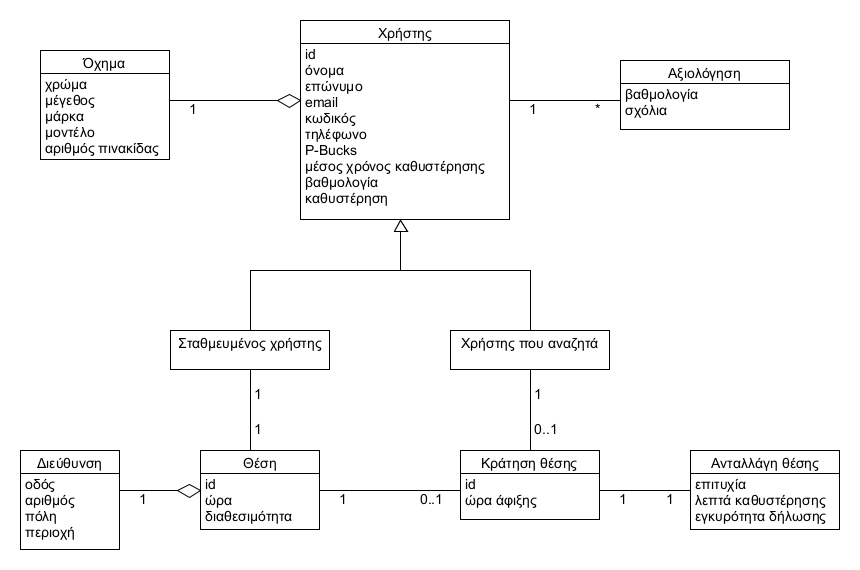

# Απαιτήσεις Λογισμικού

## Εισαγωγή

#### Στο παρόν έγγραφο βρίσκεται μία πλήρης ανάλυση των απαιτήσεων του λογισμικού της εφαρμογής.

## Περιεχόμενα

* 1.**[ Επισκόπηση μοντέλου περιπτώσεων χρήσης](#επισκόπηση-μοντέλου-περιπτώσεων-χρήσης)**  
* 2.**[ Ειδικές Απαιτήσεις ](#ειδικές-απαιτήσεις)**  
    * 2.1. **[Περιπτώσεις χρήσης](#περιπτώσεις-χρήσης)**
    * 2.2. **[Συμπληρωματικές προδιαγραφές](#συμπληρωματικές-προδιαγραφές)**
    * 2.3. **[Μοντέλο πεδίου](#μοντέλο-πεδίου)**

## Επισκόπηση μοντέλου περιπτώσεων χρήσης 

# Ειδικές Απαιτήσεις 

## Περιπτώσεις χρήσης

### Περιγραφές περιπτώσεων χρήσης 

#### [ΠΧ1 Εγγραφή χρήστη](uml/useCases/uc1-sign-up.md)  
#### [ΠΧ2 Ταυτοποίηση χρήστη](uml/useCases/uc2-user-verification.md)
#### [ΠΧ3 Δήλωση διαθεσιμότητας θέσης στάθμευσης](uml/useCases/uc3-parking-position-declaration.md)
#### [ΠΧ4 Κράτηση θέσης στάθμευσης](uml/useCases/uc4-parking-space-reservetion.md)
#### [ΠΧ5 Ανταλλαγή θέσης στάθμευσης](uml/useCases/uc5-parking-space-exchange.md)
#### [ΠΧ6 Καταχώρηση ψευδούς δήλωσης](uml/useCases/uc6-false-address-declaration.md)
#### [ΠΧ7 Ανανέωση P-Bucks](uml/useCases/uc7-P-Bucks-renewal.md)
#### [ΠΧ8 Προβολή προφίλ χρήστη](uml/useCases/uc8-view-profile.md)
#### [ΠΧ9 Παροχή στατιστικών](uml/useCases/uc9-statistics-allowance.md)

## Μη λειτουργικές απαιτήσεις

### Απαιτήσεις διεπαφών

#### Διεπαφές χρήστη
* Τα στοιχεία της οθόνης είναι διατεταγμένα μεταξύ τους.
* Διαφορετικές οθόνες συνδέονται μεταξύ τους μέσω συνδέσμων.

#### Διεπαφές υλικού
* Η εφαρμογή είναι συμβατή με τα χαρακτηριστικά των κινητών συσκευών.

#### Διεπαφές επικοινωνίας
* Το σύστημα ενημερώνει επαρκώς τους χρήστες σχετικά με την ανταλλαγή θέσης τόσο κατά τη διάρκεια όσο και κατά την ολοκλήρωση της.

### Περιορισμοί σχεδίασης και υλοποίησης

### Ποιοτικά χαρακτηριστικά

#### Απόδοση
* Γρήγορη ανταπόκριση στις εντολές του χρήστη.
* Αποτελεσματική διαχείριση των δεδομένων για τις θέσεις πάρκινγκ.

#### Διαθεσιμότητα
* Το σύστημα είναι μονίμως διαθέσιμο για τους χρήστες.

#### Ασφάλεια
* Όλες οι λειτουργίες πραγματοποιούνται με διαδικασία ταυτοποίησης.
* Κρυπτογράφηση στοιχείων του χρήστη.

#### Ευελιξία
* Η εφαρμογή είναι συμβατή με τις περισσότερες εκδόσεις android.
* Δυνατότητα ενημέρωσης της εφαρμογής με νέα χαρακτηριστικά.

#### Ευχρηστία
* Η μόνη προϋπόθεση είναι ο χρήστης να έχει βασικές γνώσεις χρήσης εφαρμογών android.
* Φιλική προς τον χρήστη διεπαφή.

## Μοντέλο πεδίου 

