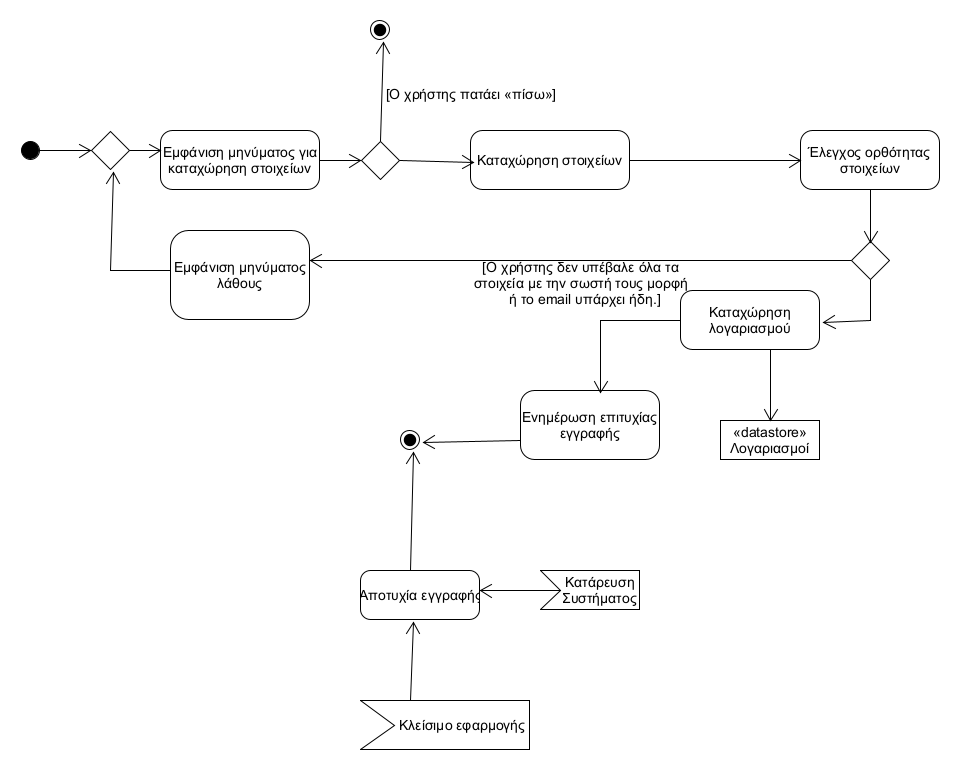
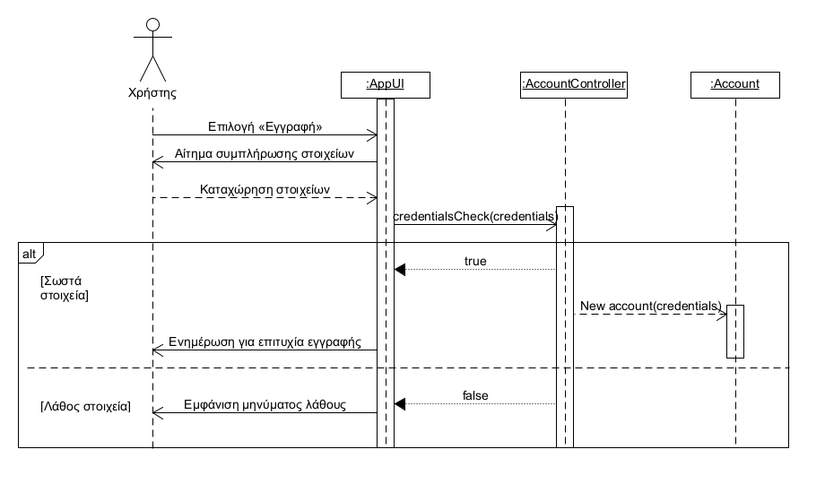

# ΠΧ1. Εγγραφή χρήστη

## Περιγραφη περιπτωσης χρησης 

**Πρωτεύων Actor**: Χρήστης     
**Ενδιαφερόμενοι**:     
  Χρήστης: Επιθυμεί να δημιουργήσει λογαριασμό ώστε 
  να μπορέσει να χρησιμοποιήσει την εφαρμογή.  
**Προϋποθέσεις**: Να μην έχει ήδη εγγραφεί στην εφαρμογή.

### **Βασική Ροή**  

1. Το σύστημα ζητά από τον χρήστη να καταχωρίσει τα προσωπικά του στοιχεία (όνομα,επώνυμο,κωδικό,email,τηλέφωνο) όσο και τα στοιχεία του αυτοκινήτου του (χρώμα, μέγεθος, μάρκα-μοντελό, αριθμός πινακίδας).
2. Ο χρήστης καταχωρεί τα παραπάνω στοιχεία.
3. Το σύστημα ελέγχει την ορθότητα των στοιχείων.
4. Το σύστημα καταχωρεί τον λογαριασμό του χρήστη.
5. Το σύστημα ενημερώνει τον χρήστη σχετικά με την επιτυχία της εγγραφής.

### **Εναλλακτικές Ροές**

4α. Ο χρήστης δεν υπέβαλε όλα τα στοιχεία με την σωστή τους μορφή ή το email υπάρχει ήδη.    
1) Το σύστημα εμφανίζει στο χρήστη μύνημα λάθους.
2) Το σύτημα επιστρέφει στο βήμα 1 της βασικής ροής.

1α. Ο χρήστης πατάει <<πίσω>.  
1) Η εγγραφή δεν πραγματοποιείται.
2) Το σύστημα επιστρέφει στην οθόνη σύνδεσης.

Σε οποιαδήποτε στιγμή ο χρήστης κλείνει την εφαρμογή.
1) Η εγγραφή δεν πραγματοποιείται.

Σε οποιαδήποτε στιγμή το σύστημα καταρρέει.       
1) Η εγγραφή δεν πραγματοποιείται.

## Διαγραμμα δραστηριοτητας

## Διαγραμμα ακολουθιας

#### [Επιστροφή](../../software-requirements.md#ειδικές-απαιτήσεις)