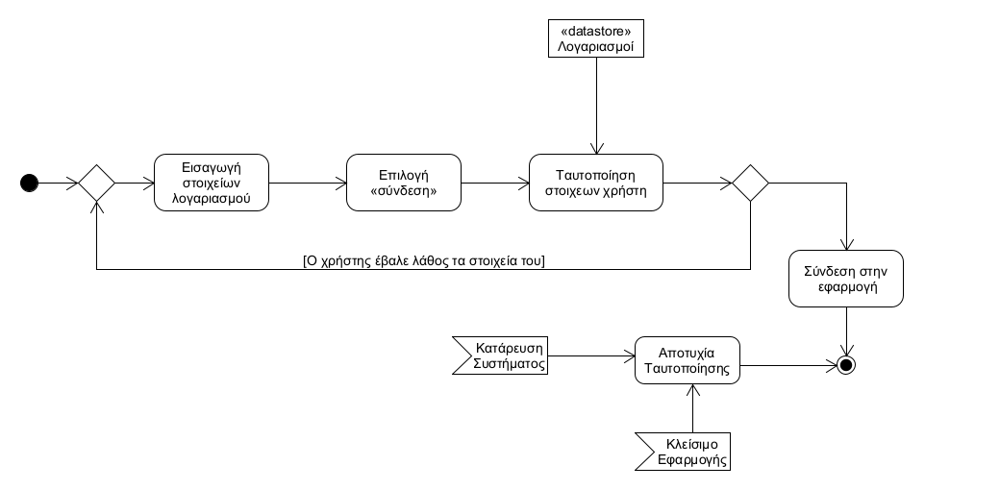

# ΠΧ2. Ταυτοποίηση xρήστη

## Περιγραφή περίπτωσης χρήσης

**Πρωτεύων Actor**: Χρήστης  
**Ενδιαφερόμενοι**:  
Χρήστης: Θέλει να συνδεθεί στην εφαρμογή ώστε να την χρησιμοποιήσει.  
**Προϋποθέσεις**: Ο χρήστης να έχει κάνει εγγραφή.

### Βασική Ροή

1. O χρήστης εισάγει τα στοιχεία του λογαριασμού του.
2. O χρήστης πατάει το κουμπί <<σύνδεση>>. 
3. Το σύστημα αναζητά τα στοιχεία του χρήστη στην λίστα εγγεγραμένων χρηστών.
4. Το σύστημα τον συνδέει στην εφαρμογή. 

**Εναλλακτικές Ροές**

4α. Ο χρήστης έχει βάλει λάθος τα στοιχεία του.
1. Το σύστημα επιστρέφει στο βήμα 1 της βασικής ροής.

Ο χρήστης κλείνει την εφαρμογή σε οποιαδήποτε στιγμή.  
1. Η ταυτοποίηση των στοιχείων δεν πραγματοποιείται.

Σε οποιαδήποτε στιγμή το σύστημα καταρρέει.
1. Η ταυτοποίηση των στοιχείων δεν πραγματοποιείται.

## Διαγραμμα δραστηριοτητας

## Διαγραμμα ακολουθιας

#### [Επιστροφή](../../software-requirements.md#ειδικές-απαιτήσεις)