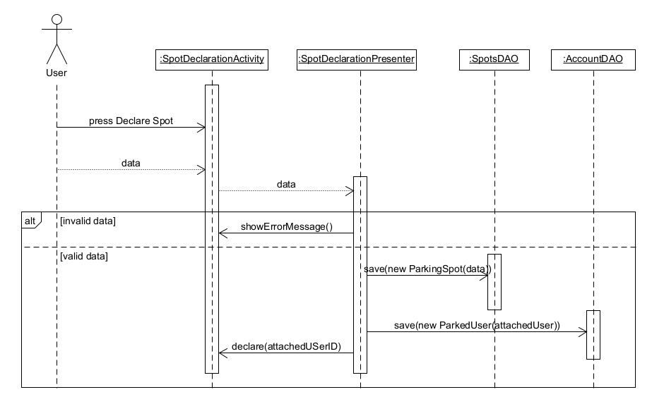

# ΠΧ3. Δήλωση διαθεσιμότητας θέσης στάθμευσης

## Περιγραφή περίπτωσης χρήσης

**Πρωτεύων Actor**: Σταθμευμένος Χρήστης     
**Ενδιαφερόμενοι**:  
Σταθμευμένος Χρήστης: Θέλει να δηλώσει στην εφαρμογή τη θέση στάθμευσης που θέλει να παραχωρήσει σε κάποια συγκεκριμένη χρονική στιγμή.  
**Προϋποθέσεις**: Ο χρήστης να έχει ταυτοποιηθεί από το σύστημα.

### Βασική Ροή

1. Ο σταθμευμένος χρήστης επιλέγει <<δήλωση θέσης>>.
2. Το σύστημα ζητάει από τον χρήστη οδό και ώρα αποχώρησης.
3. Ο σταθμευμένος χρήστης συμπληρώνει τα στοιχεία.
4. Ο σταθμευμένος χρήστης επιλέγει <<υποβολή>>.
5. Το σύστημα καταχωρεί τη δήλωση.
6. Το σύστημα ενημερώνει τον χρήστη για την επιτυχία δήλωσης θέσης.

**Εναλλακτικές Ροές**

Ο χρήστης πατάει το κουμπί <<ακύρωση>> κατά τη διάρκεια της δήλωσης θέσης στάθμευσης.
1. Η δήλωση της θέσης δεν πραγματοποιείται.
2. Το σύστημα επιστρέφει τον χρήστη στην αρχική οθόνη της εφαρμογής.

Ο χρήστης κλείνει την εφαρμογή σε οποιαδήποτε στιγμή.  
1. Η δήλωση της θέσης δεν πραγματοποιείται.

Σε οποιαδήποτε στιγμή το σύστημα καταρρέει.
1. Η δήλωση της θέσης δεν πραγματοποιείται.

## Διαγραμμα δραστηριοτητας

## Διαγραμμα ακολουθιας

#### [Επιστροφή](../../software-requirements.md#ειδικές-απαιτήσεις)