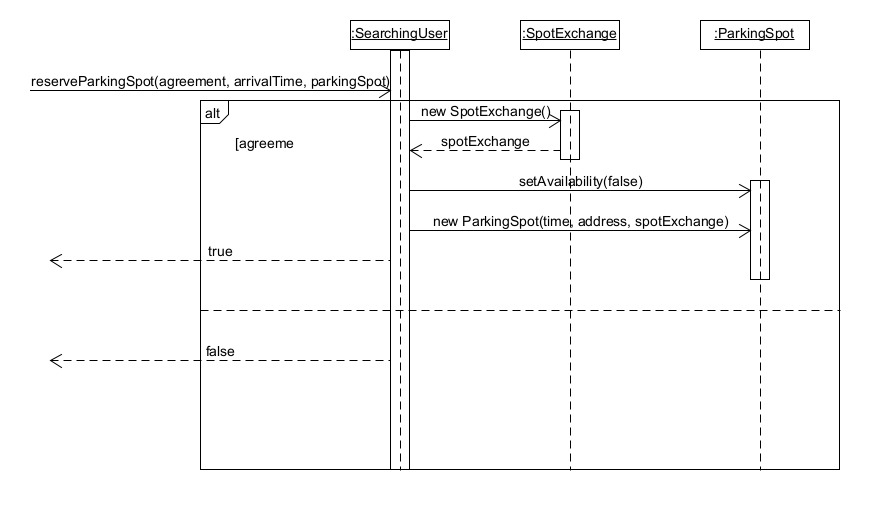

# ΠΧ4. Κράτηση θέσης στάθμευσης

## Περιγραφή περίπτωσης χρήσης 

**Πρωτεύων Actor**: Χρήστης που αναζητά θέση  
**Δευτερεύων Actor**: Σταθμευμένος χρήστης  
**Ενδιαφερόμενοι**:     
  Χρήστης που αναζητά θέση: Ψάχνει για να κρατήσει την κατάλληλη για αυτόν θέση στάθμευσης.  
  Σταθμευμένος χρήστης : Αποδέχεται ή απορρίπτει το αίτημα του χρήστη που αναζητά θέση.  
**Προϋποθέσεις**: 
1. Να έχουν ταυτοποιηθεί και οι δυο επιτυχώς από το σύστημα.
2. Ο χρήστης που αναζητά θέση να έχει τουλάχιστον 10 P-Bucks.

### **Βασική Ροή**  

1. Ο χρήστης επιλέγει <<αναζήτηση θέσης>>.
2. Το σύστημα εμφανίζει στον χρήστη τις διαθέσιμες επιλογές.
3. Ο χρήστης επιλέγει <<κράτηση θέσης>>.
4. Το σύστημα γνωστοποιεί στον σταθμευμένο χρήστη ότι ένας χρήστης επέλεξε τη θέση του για κράτηση.
5. Το σύστημα εμφανίζει στον σταθμευμένο χρήστη το προφίλ του χρήστη που επέλεξε τη θέση του.
6. Ο σταθμευμένος χρήστης αποδέχεται.
7. Το σύστημα κοινοποιεί στον χρήστη που αναζητά θέση ότι η κράτηση του ήταν επιτυχής.
8. Το σύστημα επιστρέφει στην αρχική οθόνη της εφαρμογής.

### **Εναλλακτικές Ροές**

3α. Ο χρήστης επιλέγει <<πίσω>>.    
1) Η κράτηση θέσης δεν πραγματοποιείται.
2) Το σύστημα επιστρέφει στην αρχική οθόνη της εφαρμογής.

6α. Ο σταθμευμένος χρήστης απορρίπτει.
1) Το σύστημα κοινοποιεί στον χρήστη που αναζητά θέση ότι η κράτηση του ήταν ανεπιτυχής.
2) Το σύστημα επιστρέφει στην αρχική οθόνη της εφαρμογής.

Σε οποιαδήποτε στιγμή το σύστημα καταρρέει.
1) Η κράτηση θέσης δεν πραγματοποιείται.

Ο χρήστης κλείνει την εφαρμογή πριν την αποδοχή/απόρριψη.
1) Η κράτηση θέσης δεν πραγματοποιείται.

## Διαγραμμα δραστηριοτητας

## Διαγραμμα ακολουθιας

#### [Επιστροφή](../../software-requirements.md#ειδικές-απαιτήσεις)