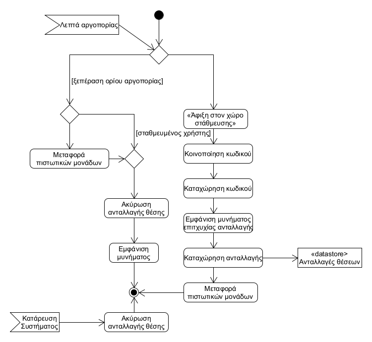
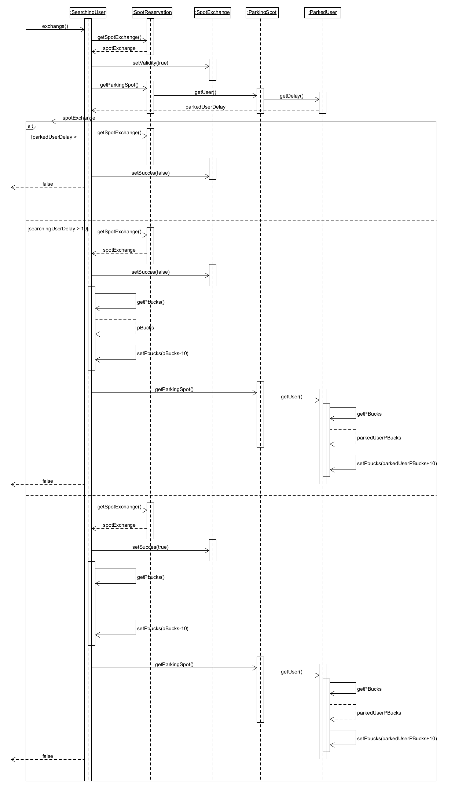

# ΠΧ5. Ανταλλαγή θέσης στάθμευσης

## Περιγραφή περίπτωσης χρήσης 

**Πρωτεύων Actor**: Χρήστης που αναζητά θέση  
**Δευτερεύων Actor**: Σταθμευμένος χρήστης  
**Ενδιαφερόμενοι**:     
  Χρήστης που αναζητά θέση: Παρκάρει το αμάξι του στη θέση που κράτησε.  
  Σταθμευμένος χρήστης : Αποχωρεί από τη θέση που δήλωσε.  
**Προϋποθέσεις**: 
1. Να έχουν ταυτοποιηθεί και οι δυο επιτυχώς από το σύστημα.
2. Να έχει γίνει επιτυχώς η κράτηση θέσης.

### **Βασική Ροή**  

Α) Ολοκλήρωση ανταλλαγής
1. Ο χρήστης που αναζητά θέση επιλέγει <<άφιξη στον χώρο στάθμευσης>>.
2. Το σύστημα κοινοποιεί έναν κωδικό στον σταθμευμένο χρήστη.
3. Το σύστημα καταχωρεί αυτόματα τον κωδικό.
4. Το σύστημα κοινοποιεί και στους δύο χρήστες ότι η ανταλλαγή ήταν επιτυχής.
5. Το σύστημα καταχωρεί την ανταλλαγή.
6. Το σύστημα αφαιρεί τις απαιτούμενες πιστωτικές μονάδες από τον χρήστη που αναζητά και τις προσθέτει στον σταθμευμένο χρήστη.

### **Εναλλακτικές Ροές**

 
  
Β) Ο χρήστης που αναζητά θέση ξεπέρασε το όριο αργοπορίας
1) Η ανταλλαγή θέσης ακυρώνεται αυτόματα από το σύστημα.
2) Το σύστημα εμφανίζει κατάλληλο μήνυμα και στους δύο χρήστες.
3) Το σύστημα αφαιρεί τις απαιτούμενες πιστωτικές μονάδες από τον χρήστη που αναζητά και τις προσθέτει στον σταθμευμένο χρήστη.

Γ) Ο σταθμευμένος χρήστης ξεπέρασε το όριο αργοπορίας
1) Η ανταλλαγή θέσης ακυρώνεται αυτόματα από το σύστημα.
2) Το σύστημα εμφανίζει κατάλληλο μήνυμα και στους δύο χρήστες.

Σε οποιαδήποτε στιγμή το σύστημα καταρρέει.
1) Η ανταλλαγή θέσης δεν πραγματοποιείται.

## Διαγραμμα δραστηριοτητας

## Διαγραμμα ακολουθιας

#### [Επιστροφή](../../software-requirements.md#ειδικές-απαιτήσεις)