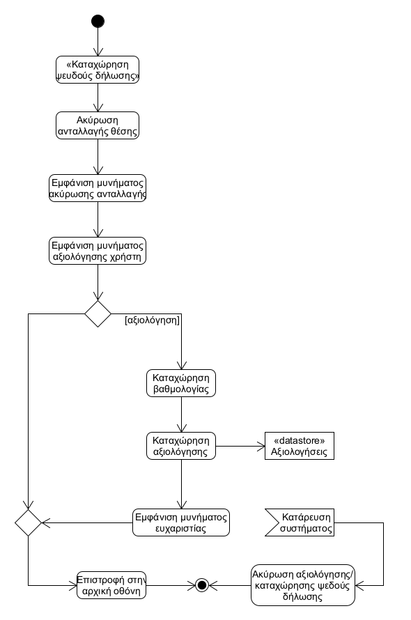

# ΠΧ6. Καταχώρηση ψευδούς δήλωσης

## Περιγραφη περιπτωσης χρησης 

**Πρωτεύων Actor**: Χρήστης που αναζητά θέση       
**Ενδιαφερόμενοι**   
Χρήστης που αναζητά θέση : Καταχωρεί στο σύστημα ότι η δήλωση του σταθμευμένου χρήστη ήταν ψευδής   
**Προϋποθέσεις**: Ο χρήστης να έχει ταυτοποιηθεί από το σύστημα.

### Βασική Ροή

1) Ο χρήστης που αναζητά θέση επιλέγει <<καταχώριση ψευδούς δήλωσης>>.
2) Η ανταλλαγή θέσης ακυρώνεται από το σύστημα.
3) Το σύστημα εμφανίζει κατάλληλο μήνυμα και στους δύο χρήστες.
4) Το σύστημα εμφανίζει μήνυμα στο χρήστη που θέλει να παρκάρει ώστε να αξιολογήσει αρνητικά τον σταθμευμένο χρήστη.
5) Ο χρήστης καταχωρεί τη βαθμολογία και τα σχόλια του στο σύστημα.
6) Το σύστημα καταχωρεί την αξιολόγηση.
7) Το σύστημα εμφανίζει στο χρήστη το μήνυμα <<Ευχαριστούμε για την αξιολόγηση>>. 

**Εναλλακτικές Ροές**

Σε οποιαδήποτε στιγμή το σύστημα καταρρέει.
1) Η Καταχώρηση ψευδούς δήλωσης και η αξιολόγηση δεν πραγματοποιείται.

## Διαγραμμα δραστηριοτητας

## Διαγραμμα ακολουθιας

#### [Επιστροφή](../../software-requirements.md#ειδικές-απαιτήσεις)

